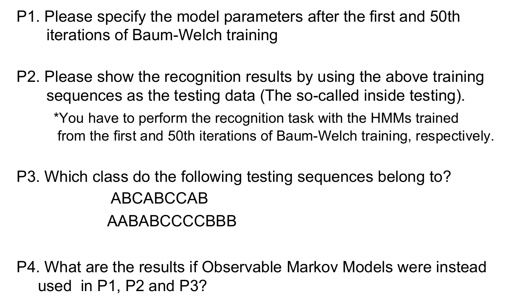

# DigitalSpeechProcessing

## Project 1: Baum-Welch Algorithm

Problem Description:
Assume Trainset1 and Trainset2 represent training language sequene for 2 different language models.

## Project 2: Hidden Markov Model, Viterbi Algorithm
